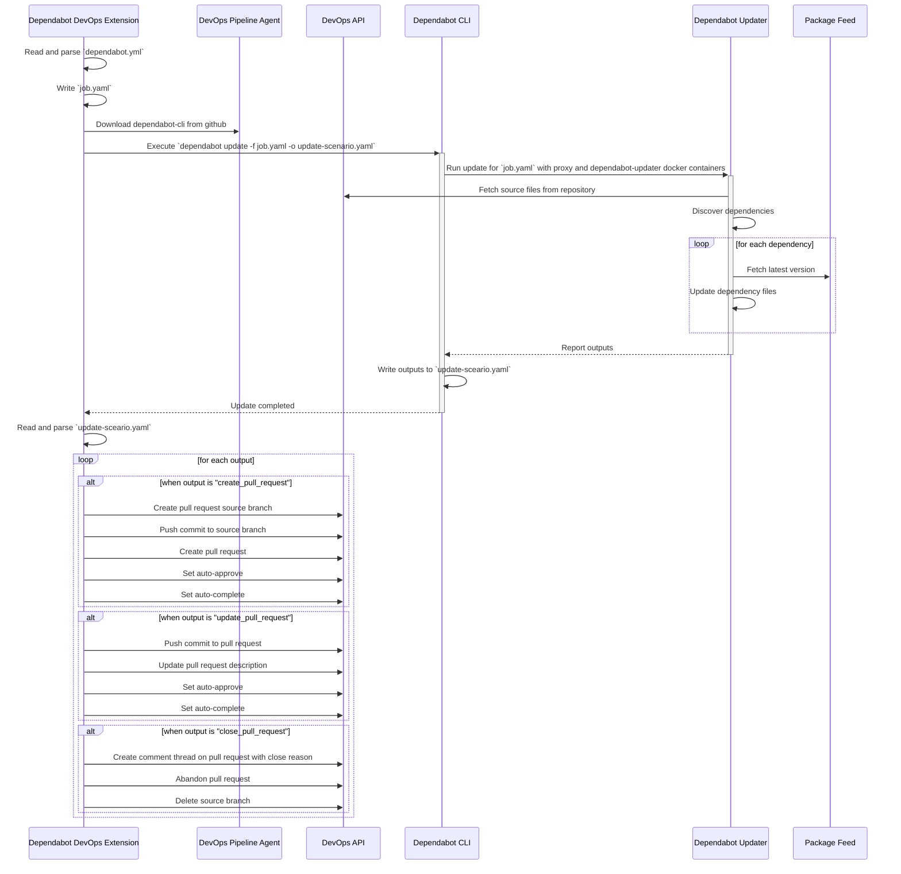
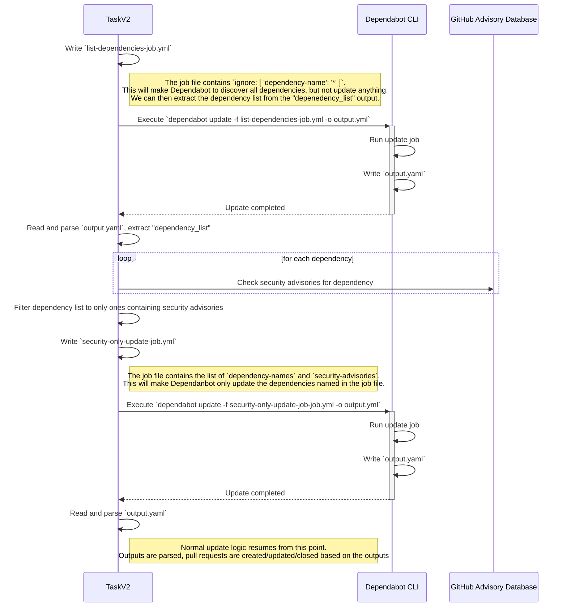

# Table of Contents

- [Using the extension](#using-the-extension)
- [Troubleshooting issues](#troubleshooting-issues)
- [Development guide](#development-guide)
   * [Getting the development environment ready](#getting-the-development-environment-ready)
   * [Building the extension](#building-the-extension)
   * [Installing the extension](#installing-the-extension)
   * [Running the task locally](#running-the-task-locally)
   * [Running the unit tests](#running-the-unit-tests)
- [Architecture](#architecture)
   * [dependabot@2 versioned update process diagram](#dependabot2-versioned-update-process-diagram)
   * [dependabot@2 hsecurity-only update process diagram](#dependabot2-security-only-update-process-diagram)

# Using the extension

Refer to the extension [README.md](../extension/README.md).

# Troubleshooting issues

Dependabot will log more diagnostic information when [verbose logs are enabled](https://learn.microsoft.com/en-us/azure/devops/pipelines/troubleshooting/review-logs?view=azure-devops&tabs=windows-agent#configure-verbose-logs); i.e. `System.Debug` variable is set to `true`.

When verbose logs are enable, Dependabot will also generate a [Flame Graph performance metrics report](https://www.brendangregg.com/flamegraphs.html), which can be viewed by [downloading the pipeline logs](https://learn.microsoft.com/en-us/azure/devops/pipelines/troubleshooting/review-logs?view=azure-devops&tabs=windows-agent#view-and-download-logs), then locating the corresponding HTML report file in the `Job` folder. To understand how to read Flame Graph reports, see: https://www.brendangregg.com/flamegraphs.html#summary

> [!WARNING]
> When sharing pipeline logs, please be aware that the **task log contains potentionally sensitive information** such as your DevOps organisation name, project names, repository names, private package feeds URLs, list of used dependency names/versions, and the contents of any dependency files that are updated (e.g. `package.json`, `*.csproj`, etc). The Flame Graph report does **not** contain any sensitive information about your DevOps environment.

> [!TIP]
> To mask environment secrets from the task log, set the `System.Secrets` variable to `true` in your pipeline.

# Development guide

## Getting the development environment ready

Install [Node.js](https://docs.docker.com/engine/install/) (18+), [Go](https://go.dev/doc/install) (1.22+), and [Docker](https://docs.docker.com/engine/install/) (with Linux containers); Install project dependencies using NPM:

```bash
cd extension
npm install
```

## Building the extension

```bash
cd extension
npm run build
```

To then generate the a Azure DevOps `.vsix` extension package for testing, you'll first need to [create a publisher account](https://learn.microsoft.com/en-us/azure/devops/extend/publish/overview?view=azure-devops#create-a-publisher) for the [Visual Studio Marketplace Publishing Portal](https://marketplace.visualstudio.com/manage/createpublisher?managePageRedirect=true). After this, use `npm run package` to build the package, with an override for your publisher ID:

```bash
npm run package -- --overrides-file overrides.local.json --rev-version --publisher your-publisher-id-here
```

## Installing the extension

To test the extension in a Azure DevOps organisation:
1. [Build the extension `.vsix` package](#building-the-extension)
1. [Publish the extension to your publisher account](https://learn.microsoft.com/en-us/azure/devops/extend/publish/overview?view=azure-devops#publish-your-extension)
1. [Share the extension with the organisation](https://learn.microsoft.com/en-us/azure/devops/extend/publish/overview?view=azure-devops#share-your-extension).

## Running the task locally
To run the latest task version:
```bash
npm start
```

To run a specific task version:
```bash
npm run start:V1 # runs dependabot@1 task
npm run start:V2 # runs dependabot@2 task
```

## Running the unit tests

```bash
cd extension
npm test
```

# Architecture

## dependabot2 versioned update process diagram
High-level sequence diagram illustrating how the `dependabot@2` task performs versioned updates using [dependabot-cli](https://github.com/dependabot/cli). For more technical details, see [how dependabot-cli works](https://github.com/dependabot/cli?tab=readme-ov-file#how-it-works).



## dependabot2 security-only update process diagram
High-level sequence diagram illustrating how the `dependabot@2` task performs security-only updates using [dependabot-cli](https://github.com/dependabot/cli).

