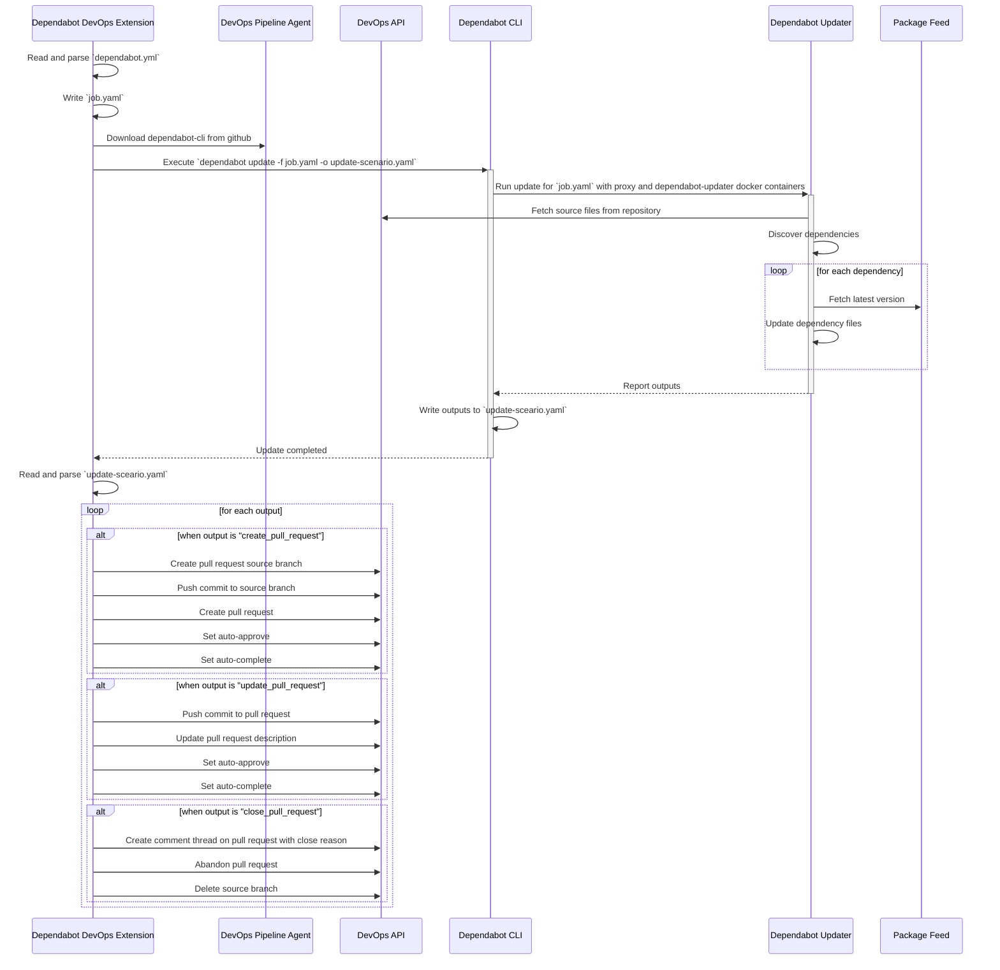

# Table of Contents

- [Using the extension](#using-the-extension)
- [Development guide](#development-guide)
   * [Getting the development environment ready](#getting-the-development-environment-ready)
   * [Building the extension](#building-the-extension)
   * [Installing the extension](#installing-the-extension)
   * [Running the task locally](#running-the-task-locally)
   * [Running the unit tests](#running-the-unit-tests)
- [Architecture](#architecture)
   * [Task V2 high-level update process diagram](#task-v2-high-level-update-process-diagram)


# Using the extension

Refer to the extension [README.md](../extension/README.md).

# Development guide

## Getting the development environment ready

Install [Node.js](https://docs.docker.com/engine/install/) v18 or higher; Install project dependencies using NPM:

```bash
cd extension
npm install
```

## Building the extension

```bash
cd extension
npm run build
```

To then generate the a Azure DevOps `.vsix` extension package for testing, you'll first need to [create a publisher account](https://learn.microsoft.com/en-us/azure/devops/extend/publish/overview?view=azure-devops#create-a-publisher) for the [Visual Studio Marketplace Publishing Portal](https://marketplace.visualstudio.com/manage/createpublisher?managePageRedirect=true). After this, use `npm run package` to build the package, with an override for your publisher ID:

```bash
npm run package -- --overrides-file overrides.local.json --rev-version --publisher your-publisher-id-here
```

## Installing the extension

To test the extension in a Azure DevOps organisation:
1. [Build the extension `.vsix` package](#building-the-extension)
1. [Publish the extension to your publisher account](https://learn.microsoft.com/en-us/azure/devops/extend/publish/overview?view=azure-devops#publish-your-extension)
1. [Share the extension with the organisation](https://learn.microsoft.com/en-us/azure/devops/extend/publish/overview?view=azure-devops#share-your-extension).

## Running the task locally
To run the latest task version:
```bash
npm start
```

To run a specific task version:
```bash
npm run start:V1 # runs dependabotV1 task
npm run start:V2 # runs dependabotV2 task
```
## Running the unit tests

```bash
cd extension
npm test
```

# Architecture

## Task V2 high-level update process diagram
High-level sequence diagram illustrating how the `dependabotV2` task performs updates using [dependabot-cli](https://github.com/dependabot/cli). For more technical details, see [how dependabot-cli works](https://github.com/dependabot/cli?tab=readme-ov-file#how-it-works).


